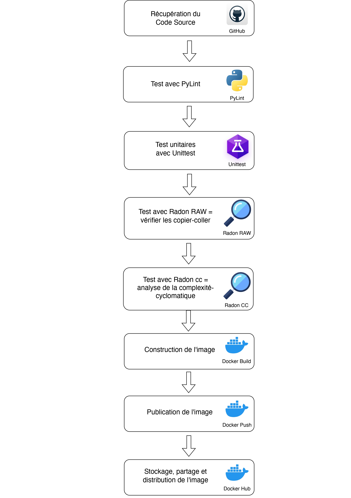

# Documentation du pipeline CI/CD pour une application Python

  Ce README explique en détails les étapes les étapes pour faire une pipeline CI/CD.

## Descriptions des fichiers fournis

  Ces fichiers sont nécessaires pour réaliser le tp:

    - `gitlab-ci.yml` est le fichier qui défini la pipeline.

    - `configure_runner.sh` est le script shell qui automatise la configuration d'un GitLab Runner.

    - `docker-compose.yml` est le fichier qui définit les 2 conteneurs nécessaires pour exécuter la pipeline sur gitlab local.

    - `tp_3_CI.pdf` est le document du tp.

    ``` sh
    . # Arborescence du repository
    ├── README.md
    ├── configure_runner.sh
    ├── docker-compose.yml
    ├── pipeline-ci.jpg
    └── tp_3_CI.pdf
    ```

## Schéma visuel d'un pipeline d'intégration continue



## Configuration des paramètres

  Les variables de configurations sont dans le `.gitlab-ci.yml`.

## Étapes du pipeline

  1. **Récupération du code source :** Clonez le code source depuis un dépôt Git.
  2. **Linting :** Vérifiez que le code respecte les normes de codage.
  3. **Vérification des copier-coller :** Détectez les copier-coller dans le code.
  4. **Analyse de la complexité cyclomatique :** Analysez la complexité du code.
  5. **Tests unitaires :** Exécutez les tests unitaires de l'application.
  6. **Construction de l'image Docker :** Créez une image Docker de l'application.
  7. **Push de l'image Docker :** Poussez l'image sur Docker Hub.

## Configuration du Projet

  1. Clonez le dépôt Git sur votre machine locale.
  2. Configurez les variables d'environnement sensibles sur GitLab.
  3. Enregistrez un runner GitLab sur votre serveur avec le token d'enregistrement de GitLab.
  4. Exécutez le conteneur `gitlab-runner` avec une configuration appropriée.
  5. Créez un projet sur GitLab et importez le code source depuis le dépôt Git.
  6. Modifiez le fichier `.gitlab-ci.yml` pour correspondre à votre application.
  7. Lancez la pipeline CI/CD sur GitLab en spécifiant la branche à partir de laquelle vous souhaitez exécuter le pipeline.

## Visualisation des Résultats

  - Suivez la progression de la pipeline dans GitLab et consultez les logs des jobs.
  - Téléchargez les rapports de test depuis GitLab.
  - Consultez l'image Docker construite dans votre compte Docker Hub.

Ce projet vise à automatiser le processus de développement et de déploiement de votre application Python. Personnalisez le fichier `.gitlab-ci.yml` en fonction de votre propre application et infrastructure.

J'ai retiré les données des variables qui doivent être modifiés.
